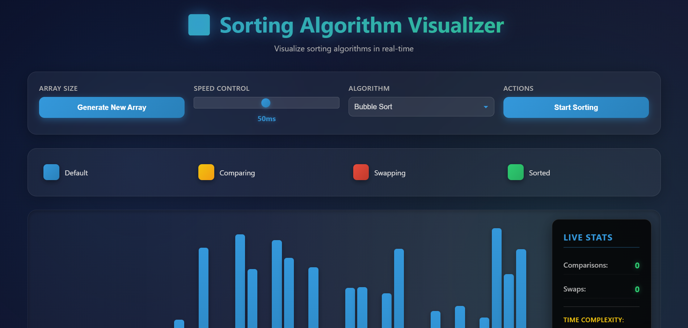

# 🔀 Sorting Algorithm Visualizer

A modern, interactive web application that visualizes sorting algorithms in real-time. Watch how different sorting algorithms work step-by-step with beautiful animations and live statistics.

**Live Demo:** [https://sorting-viz-mu.vercel.app/](https://sorting-viz-mu.vercel.app/)

<!-- Add screenshot of the main application interface here -->



## ✨ Features

- **Real-time Visualization**: Watch sorting algorithms in action with smooth animations
- **Multiple Algorithms**: Supports Bubble Sort, Selection Sort, and Insertion Sort
- **Interactive Controls**:
  - Generate random arrays of different sizes
  - Adjustable speed control (1-100ms)
  - Algorithm selection dropdown
- **Live Statistics**:
  - Real-time comparison counter
  - Swap counter
  - Time complexity display
- **Color-coded States**:
  - Default (Blue): Unsorted elements
  - Comparing (Yellow): Elements being compared
  - Swapping (Red): Elements being swapped
  - Sorted (Green): Elements in their final position
- **Big O Complexity Reference**: Built-in cheat sheet showing time complexity for each algorithm

## 🛠️ Technologies Used

- **HTML5**: Structure and semantic markup
- **CSS3**: Modern styling with dark theme and smooth transitions
- **JavaScript (ES6+)**: Core logic with modular architecture
  - ES6 Modules
  - Async/Await for smooth animations
  - Object-oriented design patterns

## 📁 Project Structure

```
SortingViz/
├── index.html              # Main HTML file
├── src/
│   ├── app.js             # Main application controller
│   ├── algorithms/        # Sorting algorithm implementations
│   │   └── index.js
│   ├── visualizer/        # Visualization logic
│   │   └── index.js
│   ├── constants/         # Application constants
│   │   └── index.js
│   ├── utils/            # Utility functions
│   │   └── index.js
│   └── styles.css        # Styling and theme
└── README.md
```

## 🎮 How to Use

1. **Generate Array**: Click "Generate New Array" to create a new random array
2. **Select Algorithm**: Choose from Bubble Sort, Selection Sort, or Insertion Sort
3. **Adjust Speed**: Use the speed slider to control animation speed (1-100ms)
4. **Start Sorting**: Click "Start Sorting" to begin the visualization
5. **Watch the Magic**: Observe the algorithm in action with color-coded states

## 📝 License

This project is open source and available for educational purposes.

## 🤝 Contributing

Contributions, issues, and feature requests are welcome! Feel free to check the issues page.

---

**Built with ❤️ for learning and understanding sorting algorithms**
